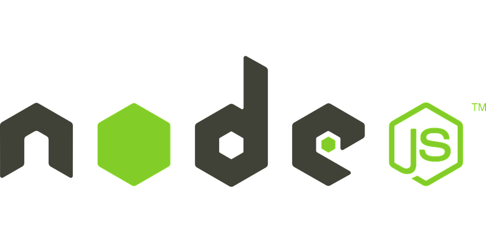

    

### 📚 Bem vindo ao meu repositório do Curso de Node JS

 

#### ☕ O que é esse repositório?
#### Então galera, esse repositório aqui é um lugarzinho aonde eu vou postar todas as aulas e projetos que eu estou fazendo de NodeJS 

#### 🚀 Mas afinal, qual a finalidade desse repositório?
#### Aqui eu irei guardar todas as aulas, todos os projetos que eu for cumprindo/realizando durante o curso. Os objetivos são dois: Manter sempre um backup dos meus objetos de estudo e também para compartilhar com os outros membros do curso os códigos desenvolvidos durante as aulas.

#### 👨🏻‍🚀 Aqui você também pode encontrar algo pra te ajudar além dos códigos. Dentro da pasta 'Apostilas' você vai encontrar algumas apostilas de Javascript e NodeJS. Todas para você baixar e aprender sobre Javascript e NodeJS.

#### 👨🏻‍💻 Você quer contribuir com esse repositório? Eu ficaria muito agradecido!
#### Caso você queria contribuir com esse repositório, você precisa fazer um fork nele com as suas alterações e depois me enviar uma solicitação :)