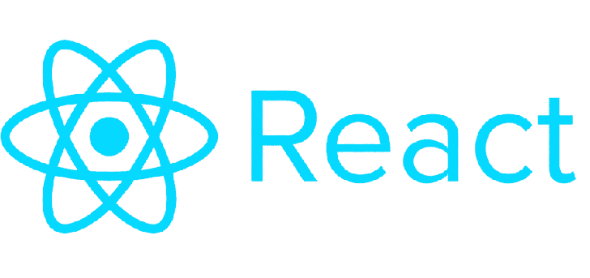

 

### Curso de React

#### ☕ O que é esse repositório? 
##### Esse é um repositório para o curso de React da Cod3r que eu estou fazendo.
##### 🚀 Curso Iniciado em: 01/10/2020

#### 📚 Qual a finalidade dele? 
##### A finalidade desse repositório é simples, é um lugarzinho aonde eu vou poder postar todas as aulas, todos os exercicios e todos os projetos que forem sendo realizados durante o curso.

